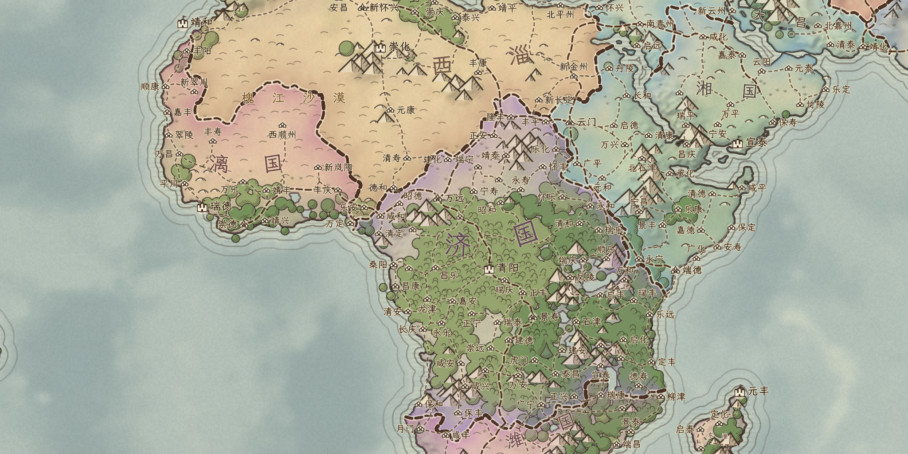
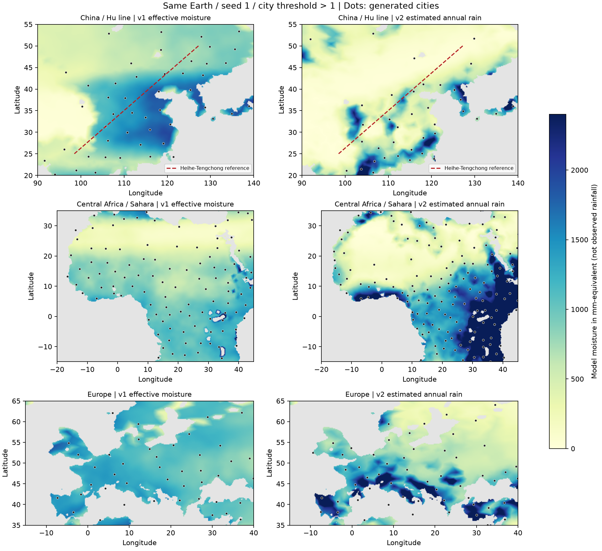
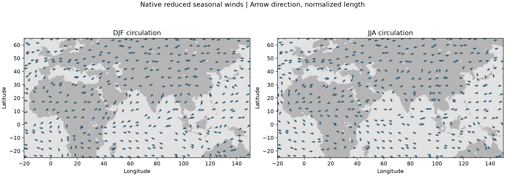

# 地球季节环流与气候聚落 v2

这是 v2 的历史实现及验收记录。当前默认已更新为 v3，寒流降雨、水分收支、生长季和城市密度的修正见 [CLIMATE_LIMITS.md](CLIMATE_LIMITS.md)。选择器保留 v2、v1 季风湿润支持及原版气候作为对照；旧快照保留原数据，v2 再生成仍使用原算法。

## 调整内容

降雨改为四季近似：DJF、MAM、JJA、SON 分别求风场和水汽输送，再取季节年化降雨率的平均值作为年降雨估计。旧 v1 使用 `max(常年水分, 夏季湿润支持)`，不能直接当作观测年雨量；两版图中的毫米值属于不同模型指标。

新风场包含移动的赤道辐合带、信风、西风带、副热带下沉干空气交换、陆海季节加热梯度、科氏偏转和风场辐合。真实高程用于迎风抬升、高山水汽阻挡及背风干燥；海洋与宽水体补充水汽，部分落地水分循环回大气。无水源时不会凭空增雨。全球经线循环，输入约 1° 气候网格、每季 100 次输送迭代，原球面网格与真实高程不变。

机制参考 [Met Office 全球环流](https://weather.metoffice.gov.uk/learn-about/weather/atmosphere/global-circulation-patterns) 和 [季风](https://weather.metoffice.gov.uk/learn-about/weather/types-of-weather/wind/monsoons)。刚果盆地除了海洋输送，还存在当地水分循环；研究给出的约 25% 再循环比例为本轮参数提供参考，但本简化模型的逐步回流系数不等同于研究中的流域水分来源比例。[NASA GISS / Dyer et al. 2017](https://www.giss.nasa.gov/pubs/abs/dy07000h.html)。

四季风场使用东、北分量；接到原 atlas 球面与海冰接口时转换为东、南分量。此方向转换已通过专门失败用例及修复后回归验证。年平均风场也用于海冰冷空气输送；因此北方海岸宜居度可受海冰变化影响。年平均温度和洋流仍沿用 atlas 管线，并未移植完整的大气动力学或海气耦合。

聚落模型同时增加气候农业潜力：常年水分、生长季水分、温度及过湿惩罚决定潜力值，随后继续使用原高程、坡度、供水、海岸和严格城市阈值。湿润平原可支持城市，即使自然群落为草地；没有导入现实城市、人口或耕地图。

新密度配置的省份种子间距系数为 `clamp((13/(宜居度+1))^0.65, 0.55, 2.3)`，最小合并面积比例从 `0.22` 调为 `0.12`，让高潜力地区的小省份保留下来。省份目标面积参数仍为 750。旧随机星球及 v1 默认配置继续使用原间距和合并规则。城市仍是一省至多一个治所，不创建道路路口城市。

**黑河—腾冲线与国家掩码仅用于测试和统计，不参与风场、增雨、农业潜力或种子生成。** 验证采用 Natural Earth v5.1.2 CHN 的 1° 粗掩码，面积与计数是近似统计，不代表现实人口比例。胡焕庸线与水分、地形的相关性可参考 [北京师范大学地理研究材料](https://wangjingai.bnu.edu.cn/PDFFiles/%E6%B5%85%E8%B0%88%E8%83%A1%E7%84%95%E5%BA%B8%E4%BA%BA%E5%8F%A3%E5%88%86%E7%95%8C%E7%BA%BF%E7%9A%84%E8%AE%A4%E8%AF%86.pdf)；本轮没有用这条线强行切分城市。

## 同输入结果

种子 1、相同真实高程／海陆、33940 个球面地块、省份面积参数 750、城市治所宜居度严格大于 1。v1 为上轮冻结快照。

| 指标 | v1 | v2 |
| --- | ---: | ---: |
| 全球省份 / 城市 / 去重道路段 | 682 / 624 / 682 | 744 / 695 / 744 |
| 胡线东南侧城市 | 19 | 22 |
| 胡线西北侧城市 | 11 | 5 |
| 胡线两侧单位面积城市密度比（东南/西北） | 2.7 | 6.9 |
| 华南研究窗口城市 | 12 | 14 |
| 中国东部研究窗口城市 | 19 | 19 |
| 欧洲研究窗口城市 | 30 | 41 |
| 刚果盆地研究窗口城市 | 8 | 11 |
| 戈壁研究窗口城市 | 4 | 0 |
| 撒哈拉研究窗口沙漠占比 | 46.1% | 65.6% |

新年降雨估计：华北约 545 mm、华南约 803 mm、刚果盆地约 1671 mm、欧洲约 1342 mm、撒哈拉约 197 mm、戈壁约 61 mm。全部为模型的陆地面积加权结果；窗口定义及完整参数见 [metrics.json](circulation/metrics.json)。

密度增加不能全部归因于降雨。固定新气候、恢复原版聚落规则的消融对照中，欧洲为 30 城、刚果盆地为 10 城、中国东部为 16 城；启用农业潜力及新间距后分别为 41、11、19 城。统计明确区分气候变化和划省／聚落规则变化。

## 实机与数值图

地图来自真实 Godot 4.7.1 OpenGL Compatibility / RX 7600，2048×1024，无像素后处理。前后采用相同相机、缩放与图层。各视图完整复现参数和源文件指纹见 [manifest.json](circulation/manifest.json)。

| 区域 | v1 | v2 |
| --- | --- | --- |
| 中国东部 7× | [前](circulation/before-china.png) | [后](circulation/after-china.png) |
| 欧洲 5.5× | [前](circulation/before-europe.png) | [后](circulation/after-europe.png) |
| 非洲中部与撒哈拉 3.5× | [前](circulation/before-africa.png) | [后](circulation/after-africa.png) |
| 全球 1× | [前](circulation/before-world.png) | [后](circulation/after-world.png) |







数值图直接读取原生导出的字段；风向图箭头长度归一化，不能作为米/秒风速图。

## 验证

- `atlas_seasonal_circulation.gd`：信风／西风、赤道辐合、海洋水汽、无水源零雨、季节平均合成、经线循环平移、重复生成确定通过。
- `atlas_climate_settlement.gd`：湿润平原农业支持、干旱与冰冻抑制、依水分递增、宜居度决定间距通过。
- `atlas_earth_circulation.gd`：完整地球重复生成的降雨字段逐值一致；真实高程、网格、海陆、温度不变；季度合成、风向接口、胡线梯度、雨带／沙漠和欧洲城市群通过。
- `atlas_native_earth_preview.gd`：正式地球预览冷启动，真实图形输出、全部地块真实输入、道路禁水／冰原、快照验证通过。
- `atlas_native_earth_routes.gd`：78 个含城市的可通行分量均连通，省份连通、共享段唯一、完整连接引用通过。
- `atlas_circulation_snapshot.gd` 与 `atlas_native_snapshot.gd`：新季节字段合法性、拒绝错误维度和非有限风场、旧快照往返通过。
- `atlas_native_preview.gd`：四模式复用、点击改属、完整快照恢复降雨及聚落模型、城市阈值清空／恢复、失败加载保留世界通过。
- 原版随机星球的宜居度与省份字段逐值一致；旧四组降雨冻结样本一致，v1 地球生成保留兼容入口。

日志记录实际种子、PID、场景、world_index、模型、参数、耗时、提交和源码指纹。最终冷启动为 `atlas-31900-1791514675-1.jsonl`，完整生成 40.036 s、显示准备 24.361 s。仅记录性能，不设门槛。图形进程退出时仍有原预览 SubViewport / GPU 资源释放告警，未宣称该告警已解决。

## 精度与边界

这是依据气候机制和研究资料调整的简化气候／潜在聚落模型，**没有用全球观测降水对参数进行数值拟合**，也没有人口经济历史推演。更清楚的城市与沙漠分布不等于真实人口密度已复现。

仍存在华南局部偏干、秋季降雨不足、山地迎风抬升偏强及东非局部偏湿等偏差；当前温度、土壤肥力和季节长度也较粗。测试中的区域雨量范围属于宽松的结构验收，不能替代气候站或再分析数据误差评估。

## 复现与消融

```powershell
# 复现本页 v2 气候与农业密度
& 'D:/ProjectICreate/Godot_v4.7.1-stable_win64.exe' --path . --rendering-method gl_compatibility atlas_earth_preview.tscn -- --atlas-rainfall=seasonal_circulation_v2
# 新气候 + 原版聚落规则，区分气候和城市规则贡献
& 'D:/ProjectICreate/Godot_v4.7.1-stable_win64.exe' --path . --rendering-method gl_compatibility atlas_earth_preview.tscn -- --atlas-rainfall=seasonal_circulation_v2 --atlas-settlement=atlas_original
# 上轮 v1
& 'D:/ProjectICreate/Godot_v4.7.1-stable_win64.exe' --path . --rendering-method gl_compatibility atlas_earth_preview.tscn -- --atlas-rainfall=legacy_monsoon_global_v1
```

运行时全为原生 GDScript / Shader；Python 仅用于开发数值图和测试掩码。测试掩码出处、SHA256、精度与公共领域许可记录在 `tests/fixtures/atlas_china_study_mask.json`，可用 `scripts/tools/atlas_prepare_china_study.py` 重新构建。未提交、未推送。
