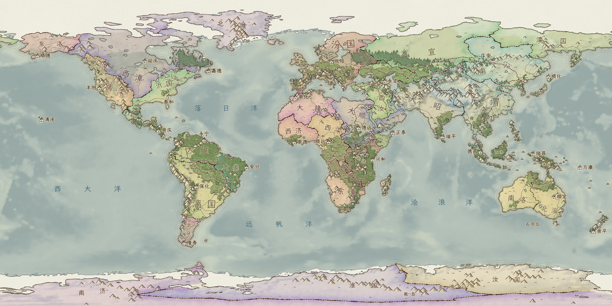
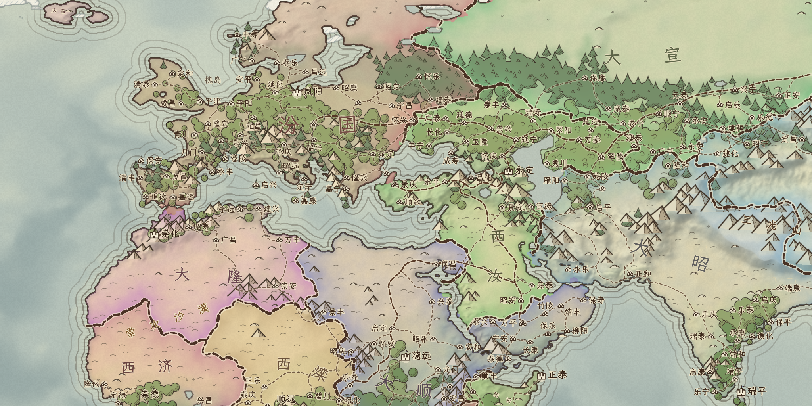
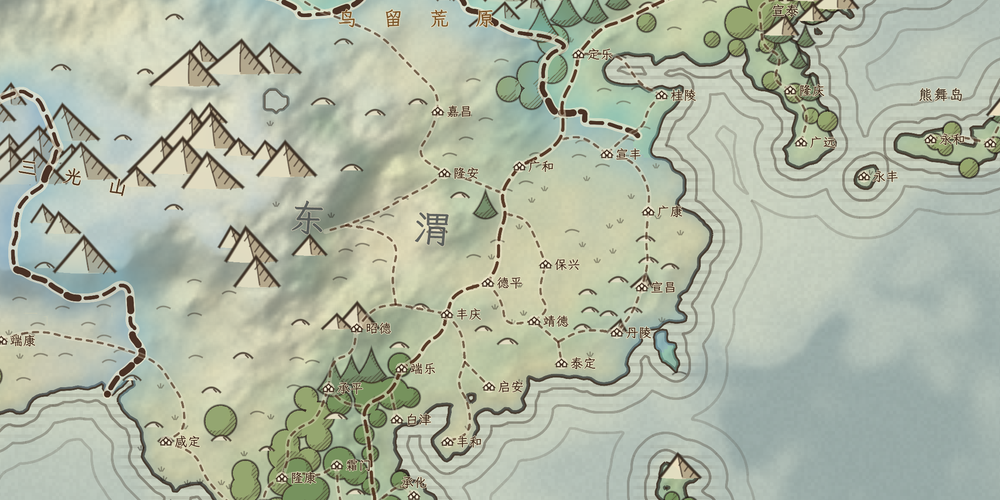
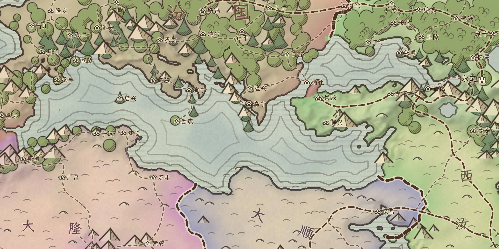

# 真实地球预览

当前默认为降雨 v5、评分 v6：见 [两季封顶与前后宜居度热力图](TWO_SEASON_CAP.md)。[降雨 v5 修正](RAINFALL_V5.md)保持不变；下文 v4 与更早截图、数量仍作为历史对照。


打开 `res://atlas_earth_preview.tscn`，按 F6。也可在原预览点击“真实地球”；“随机星球”恢复原版随机生成。正式游戏入口保持不变。

```powershell
& 'D:/ProjectICreate/Godot_v4.7.1-stable_win64.exe' --path . atlas_earth_preview.tscn
```

**真实的是高程、海陆和湖泊输入。气候、群落、宜居度、城市、省份、国家、道路和名称仍由模型生成，并不表示现实政治区划或真实城市。** 河流继续仅用于环境供水，画面不显示河流，没有河流交通。

地球现在默认使用 **v4 季节降水／短时锋面和v4四季联合宜居度**。[本轮降水修正、热力图与新实机画面](RAINFALL_V4.md)记录中国秋冬、西伯利亚季节性及剩余偏差；[四季宜居度公式](SEASONAL_CAPACITY.md)保持不变。下文城市数量和截图是冻结v3历史对照。预览可切回v3、v2、v1季风湿润支持和原版气候；[v3历史修正](CLIMATE_LIMITS.md)、[v2历史对照](CIRCULATION.md)、[v1历史对照](MONSOON.md)保留原记录。

## 本次运行

2026-10-09，Godot 4.7.1 / AMD Radeon RX 7600 / OpenGL Compatibility，种子 1，城市治所宜居度严格大于 1，36000 个目标地块，2048×1024 等距圆柱。

| 地块 | 陆地地块 | 海洋地块 | 湖泊地块 | 省份 | 城市 | 去重道路段 |
| ---: | ---: | ---: | ---: | ---: | ---: | ---: |
| 33940 | 9650 | 24202 | 88 | 651 | 527 | 570 |

完整原生生成 39.512 s，显示准备 23.751 s。这是一次本机记录，没有设置性能门槛。实际冷启动日志为 `user://debug_runs/atlas_preview/atlas-24824-1791518183-1.jsonl`；截图另从相同原生快照以固定 2048×1024 渲染视口采集，避免系统窗口限宽。[截图清单](earth/manifest.json) 保存生成／采集运行事件、参数、源文件与截图 SHA256。

## 实机截图

政治全图：



欧亚近景：



中国东部近景：



地中海近景：



[地形](earth/earth-mode-1.png) · [省份](earth/earth-mode-2.png) · [宜居度](earth/earth-mode-3.png)

截图来自真实 Godot 图形渲染器，未后处理。全图 1×、欧亚 3×、中国东部／地中海 7×。

## 输入与精度

- 高程与海深：GMT 发布的 SRTM15+ v2.7 `earth_relief_06m_p.grd`，3600×1800、6 角分，米单位，0.5 m 编码量化。原始高程已经经过约 31.5 km 全宽高斯滤波，不能将它称为未滤波的 15 角秒 DEM。[GMT 官方说明](https://www.generic-mapping-tools.org/remote-datasets/earth-relief.html)、[Scripps 数据来源](https://topex.ucsd.edu/WWW_html/srtm15_plus.html)。
- 海陆和湖泊：Natural Earth v5.1.2 的 1:5000 万 land／lakes。海陆不由高程正负判断，低于海平面的陆地仍为陆地；land 中的里海孔洞按地理位置明确归为湖泊。没有把所有封闭像素水块当成湖泊，防止低分辨率窄海峡消失后将黑海误判为湖。[Natural Earth 使用条款](https://www.naturalearthdata.com/about/terms-of-use/)。
- 导入边界：真实输入替代随机板块、造山、侵蚀和随机湖泊，之后复用同一原生气候、宜居度、省份、道路和画风管线。不再次侵蚀真实高程。
- 运行时离线读取 gzip 数值资产，SHA256 校验后在球面地块取样。Python／NetCDF／rasterio 只用于开发时打包数据，交付预览不依赖它们。
- 目前仍用约 3.4 万球面地块；海岸在下游三角网格上重建、平滑并加入原版细节扰动。大陆与主要地形来自真实数据，小岛、狭窄海峡、细海岸及小湖会简化，画面不作为测绘地图。
- 国家为静态生成，荒寒地区也会获得预览归属；无人口成长、历史、现代国家边界或真实地名导入。

完整来源 URL、输入／运行资产哈希见 `assets/atlas/earth_source.json`，转换工具为 `scripts/tools/atlas_prepare_earth.py`。

## 验证

- `atlas_native_earth.gd`：大陆、三大洋、里海、密歇根湖、黑海仍为海洋、喜马拉雅高程、海深、经线循环和极点取样通过。
- `atlas_native_earth_preview.gd`：默认地球入口原生生成；全部地块与真实水体／高程输入一致（浮点误差 <0.002 m）；道路禁水和冰原检查、完整快照验证通过，输出四模式和三个局部实机图。
- `atlas_native_earth_routes.gd`：道路通行性、相邻地块、共享段唯一性、78 个含城市的可通行分量中城市连通、省份连通、完整城市连接引用检查均通过。
- 原随机种子 1 的世界数值与上游逐字段对照继续 0 failures。

新增地球入口；现有正式欧亚、中国场景和军事／贸易系统未接入。本轮未提交、未推送。视觉验收仍由用户决定。
