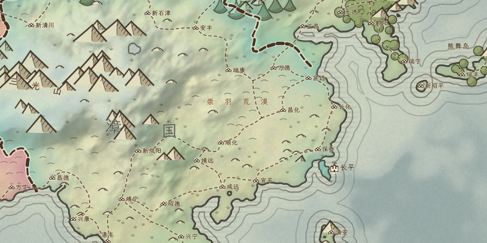
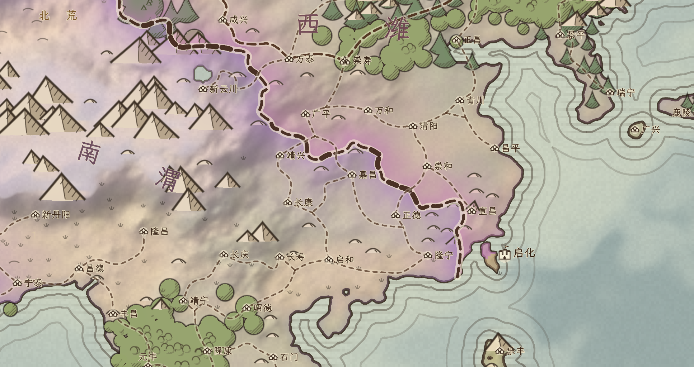
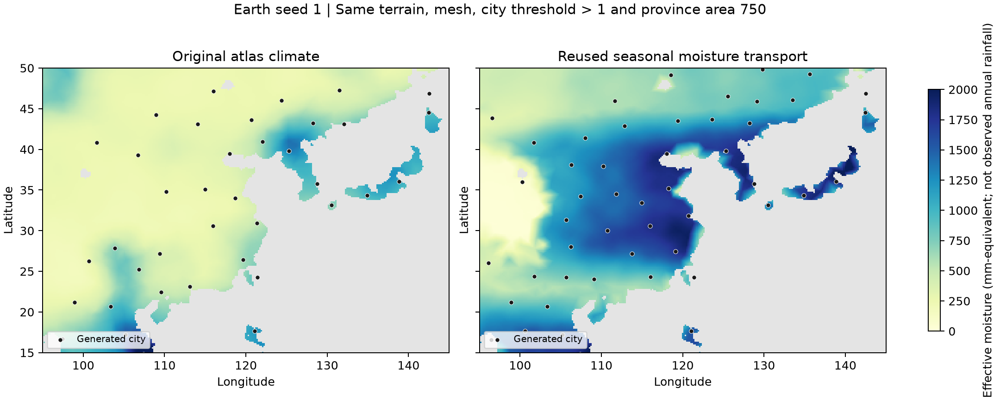

# 地球预览：复用旧降雨与季风湿润支持

本页保存上轮 v1 的历史记录。当前默认已升级为 [季节环流与气候聚落 v2](CIRCULATION.md)，v1 可以通过预览选择器或 `--atlas-rainfall=legacy_monsoon_global_v1` 复现。以下默认值、数量和截图均指 v1 当时的运行。

本次 v1 运行的 `atlas_earth_preview.tscn` 使用 `legacy_monsoon_global_v1`。预览的“地球降雨”可切回原版气候；切换会重新生成环境、省份、城市、道路及静态国家。随机星球仍使用原版气候。没有接入军事、贸易或动态季节模拟。

## 复用和全球适配

将 `SettlementEnvironment environment_v1.7` 的降雨计算抽取为 `scripts/core/rainfall_transport.gd`。旧入口直接委托共享函数，默认参数下四组冻结样本逐值一致，旧区域地图不启用全球选项。

保留旧规则：四向水汽输送、纬度风向权重、海洋补水、窄水体弱补水、侧向混合、内陆水汽衰减、副热带抑制，以及 2500–3500 m 平滑增强的高山迎风凝结和背风干燥。夏季湿润支持使用东侧及向极地输送的实际水汽，水汽不足不会仅因纬度获得加成。

全球适配在 720×360、0.5° 网格采样真实高程及海陆，经线循环，水平输送先循环三圈以减少起始边界影响。水平距离按纬度余弦缩短；原模型的归一化距离单位转换为 4000 km，全球南北距离采用约 20000 km。将结果以陆地权重插值回原球面地块，不与海洋的零降雨样本混合。

**原模型是有效水分指标，不是观测年降雨毫米数。** 本轮采用每单位 2000 mm 的全局等效换算，以适配 atlas 群落阈值；最终水分为 `max(常年输送, 夏季湿润支持)`，插值后合成，未将两者重复相加。参数、版本及 `observed_climate=false` 写入生成日志和快照。没有针对中国、欧洲等地区硬编码增雨或城市数量。

新水分重新驱动群落、环境径流、宜居度、省份种子密度、城市筛选及道路生成。真实高程、网格、海陆、温度和海冰没有变化；河流仍不显示、不参与交通。

## 同输入对照

2026-10-09；种子 1；目标地块 36000；省份面积参数 750；城市治所宜居度严格大于 1。中国东部统计范围为 105–122°E、22–42°N；东亚为 100–145°E、18–50°N。数值为陆地面积加权，非观测统计。

| 项目 | 原版气候 | 共享季风水汽模型 |
| --- | ---: | ---: |
| 全球省份 / 城市 / 去重道路段 | 661 / 602 / 654 | 682 / 624 / 682 |
| 中国东部城市 | 13 | 19 |
| 中国东部平均宜居度 | 3.72 | 14.91 |
| 中国东部有效水分（mm 等效） | 341 | 1377 |
| 东亚城市 | 33 | 41 |
| 欧洲城市 | 31 | 30 |
| 撒哈拉有效水分（mm 等效） | 326 | 266 |
| 阿拉伯有效水分（mm 等效） | 917 | 549 |

城市增加源自宜居度改变后的省份种子分布；本轮未调低城市阈值，仍是一省至多一个治所城市。重新划省也会改变静态分国与名称，图中的国家颜色变化不代表降雨颜色。

中国东部相同视角，原版在前：





有效水分与城市位置的数值对照：



[旧全图](monsoon/before-world.png) · [新全图](monsoon/after-world.png) · [统计及参数](monsoon/metrics.json) · [复现清单](monsoon/manifest.json)。地图截图来自真实 Godot OpenGL Compatibility / RX 7600，2048×1024，无像素后处理；降雨图由导出的数值字段绘制。

## 验证与限制

- `atlas_native_monsoon.gd`：四组旧输出逐值一致；经线循环平移误差 <1e-6；沿岸向内陆水汽下降；没有水源时无夏季增益。
- `rainfall_high_mountain_threshold.gd`、`settlement_environment.gd`：旧地图降雨与环境回归通过。
- `atlas_native_earth_monsoon.gd`：同输入确定、真实地形及温度不变、海洋原气候不变、群落使用新降雨、无重复合成、拒绝未知模型。
- `atlas_native_world.gd`：原随机星球种子 1 的八个世界字段仍与上游完全一致。
- `atlas_native_earth_preview.gd`：真实图形渲染器运行默认地球模型，完整快照与所有地块真实输入、道路禁水/冰原验证通过。
- `atlas_native_earth_routes.gd`：72 个含城市的通行分量均保持城市连通，省份连通、共享段唯一、完整城市连接引用有效。
- `atlas_native_preview.gd`：四模式、点击改属、空城市／阈值恢复、快照恢复降雨模型及选择器、失败加载保留世界均通过，使用同一新地球快照进行实机验证。

这是旧规则的全球适配，不是气象预报或经过气候观测标定的季风环流模型。仍有区域偏差：华北有效水分高于华南，印度湿润支持较弱；旧模型的纬度季节权重与四向输送不足以准确恢复现代降雨分布。它可以改善东亚城市过疏，但不能据此宣称真实城市密度或真实降雨已复现。

本次完整生成 30.750 s，显示准备 24.336 s；仅记录性能。图形测试退出时仍报告预览原有的 SubViewport / GPU 资源释放告警，生成、截图和断言通过，未将告警记作已解决。未提交、未推送。

## 复现命令

```powershell
# 复现 v1 地球季风水汽模型
& 'D:/ProjectICreate/Godot_v4.7.1-stable_win64.exe' --path . --rendering-method gl_compatibility atlas_earth_preview.tscn -- --atlas-rainfall=legacy_monsoon_global_v1
# 原版气候对照（需要重新生成，不读取旧开发缓存）
& 'D:/ProjectICreate/Godot_v4.7.1-stable_win64.exe' --path . --rendering-method gl_compatibility atlas_earth_preview.tscn -- --atlas-rainfall=atlas_original
```

开发数值导出工具 `scripts/tools/atlas_export_monsoon.gd` 读取忽略目录中的前后快照，绘图工具 `scripts/tools/atlas_plot_monsoon.py` 使用 NumPy / Matplotlib。这些工具不是运行时依赖。
