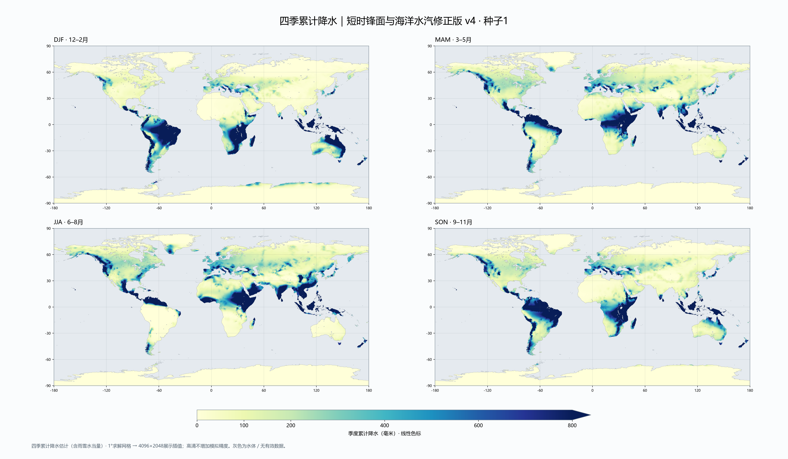
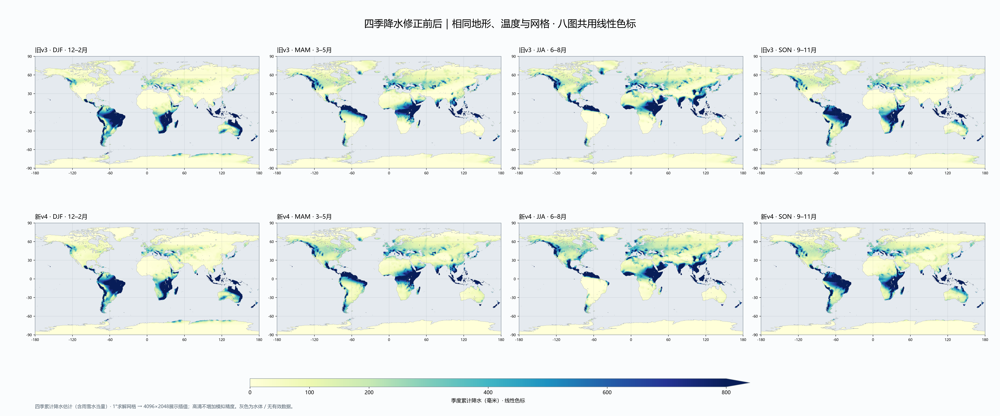

# 四季降水修正版 v4

2026-10-09。真实地球预览默认使用 `seasonal_circulation_v4`；宜居度仍用已确认的 `climate_capacity_v4` 四季公式。高程、海陆、球面网格和显示温度不变，没有按中国或西伯利亚区域人工补水／扣水。

## 原问题与修正

1. **整季只用一套平均风场。** 秋冬中国的陆地水汽被持续耗尽；偶发湿润锋面的输送没有体现在季节总量中。新版对季节背景和两种湿润锋面状态分别输送水汽、计算降水后加权。锋面从背景湿度开始，持续12个输送步，采样后6步；不再把反向风固定整个季度，避免把内陆沙漠算湿。暖地基准权重为冬夏80%／10%／10%，春秋68%／16%／16%；冷大陆按温度与大陆性连续减少锋面出现频率，局部权重始终归一化。这是简化天气状态，不是数值天气预报或实测天气频率。
2. **锋面雨带季节位移符号反向。** 旧版 `48 - 5 × 夏季强度` 把夏季雨带推向低纬，新版改为 `48 + 5 × 夏季强度`，与西风带的季节迁移方向一致。[NOAA急流季节迁移](https://www.noaa.gov/jetstream/global/jet-stream)。
3. **冷海仍有固定最低湿度，海温基准也与地图不一致。** 采用地图已有纬向温度基准，加洋流异常和半季度海温滞后，以Magnus饱和水汽关系计算供给，去掉0.06湿度下限。高纬冻结水域按温度／纬度估计开放水面比例；它是季节代理，不是观测海冰。[NOAA海冰对水汽交换的限制](https://arctic.noaa.gov/report-card/report-card-2020/sea-ice-3/)。
4. **寒冷陆地也即时回收25%降水为水汽。** 保留最高25%的原回收率，但在约−2至10℃间按温度过渡，冻结陆地不再像暖季一样即时蒸发。

保留地形雨影、海洋补水宽度、冷海稳定层、季风和原有气候适宜度窗口；不增加全年固定降雨保底值。雨雪未独立模拟，输出为季度降水水当量估计。

## 高清热力图

四季图6144×3584，单季图5120×2880，八图对照7680×3200。全部降水图使用**0–800毫米／季度的统一线性色标**；超过800显示最深色，完整值保留。旧图使用非线性色标，20–70毫米也会显示明显颜色，不能据此判断为高雨量。

[12–2月](rainfall_v4/rain-djf.png) · [3–5月](rainfall_v4/rain-mam.png) · [6–8月](rainfall_v4/rain-jja.png) · [9–11月](rainfall_v4/rain-son.png) · [PDF](rainfall_v4/rain-four-seasons.pdf)

[降水修正后的宜居度](rainfall_v4/habitat-after.png) · [原始浮点场与掩码](rainfall_v4/weather_fields.npz) · [完整参数与哈希](rainfall_v4/manifest.json)

数据先在原生Godot中计算，再使用同一球面权重投影到4096×2048展示网格。降水求解仍为1°；海岸掩码6角分，高清图没有提高模拟分辨率。灰色代表海洋、湖泊或无有效陆地数据。

## 同网格区域均值

以下为对应经纬度范围内、有效陆地展示像素按面积加权的季度降水估计，单位毫米；四季依次为12–2月、3–5月、6–8月、9–11月。

| 区域 | 旧v3 | 新v4 |
| --- | --- | --- |
| 中原近似范围，110–116°E、32–37°N | 0.02 / 113 / 563 / 0.003 | **48 / 184 / 529 / 122** |
| 中国南部近似范围，105–122°E、22–34°N | 1.5 / 147 / 608 / 3.8 | **35 / 227 / 694 / 87** |
| 欧洲中纬度，10°W–30°E、45–55°N | 206 / 305 / 324 / 257 | **205 / 317 / 365 / 304** |
| 西西伯利亚，60–90°E、55–65°N | 21 / 68 / 70 / 47 | **3 / 74 / 106 / 33** |
| 东西伯利亚，100–140°E、55–65°N | 24 / 64 / 66 / 41 | **11 / 69 / 97 / 39** |
| 北极沿岸，100–160°E、65–72°N | 27 / 32 / 56 / 25 | **2 / 20 / 45 / 3** |

西伯利亚没有被整体强制压干；夏季降水峰值与寒冷季节分离。中原气候适宜度均值从55.1升至80.3，最终宜居度从11.21升至17.36；温度窗口与聚合公式没有再次改变。

## 站点对照与未解决偏差

`atlas_rainfall_seasons.gd` 在实际站点经纬度对1°模型网格做陆地双线性采样：

| 位置 | 旧v3季度估计 | 新v4季度估计 | 正常值季度合计 |
| --- | --- | --- | --- |
| 郑州113.65°E、34.72°N | 0.01 / 178 / 602 / 0.001 | 57 / 217 / 541 / 129 | 31 / 114 / 343 / 142 |
| 雅库茨克129.72°E、62.02°N | 19 / 31 / 30 / 16 | 3.4 / 39 / 60 / 10 | 27 / 35 / 107 / 65 |

正常值来自[JMA郑州站](https://www.data.jma.go.jp/tcc/tcc/products/climate/climatview/graph_mkhtml.php?e=0&k=0&m=5&n=57083&r=1&s=1&y=2025)、[JMA雅库茨克站](https://www.data.jma.go.jp/tcc/tcc/products/climate/climatview/graph_mkhtml.php?e=0&k=0&m=5&n=24959&r=1&s=1&y=2025)的月正常值求和，仅用于校验；运行时没有导入这些数值。

**仍未达成实测气候精度：** 郑州春夏偏湿，雅库茨克冬秋仍偏干、夏季总量也偏低；非洲东南仍过湿（所选区域年均估计约3155毫米），广义戈壁窗口年均约248毫米，部分地区较旧版变湿。单点干燥性检查通过不代表所有沙漠窗口均已校准。本轮解决固定风场造成的中国近零降水、锋面季节反向和冷海供给处理错误，不能宣称整张图已经真实还原。

统计方式必须区分：上述站点表是1°模型直接采样；热力图先在33940个球面节点采样，再投影插值。`manifest.json`另外记录最近球面节点的位置和数值，不应将该节点误认成真实城市测站。

## Godot实机与验证

实际默认场景 `atlas_earth_preview.tscn`，种子1，降雨v4／宜居度v4，PID6748，OpenGL Compatibility／AMD RX7600。本次重建得到 **732省份／649城市／732去重路段**，完整生成约50.3秒，显示约23.7秒；仅记录，不设置性能门槛。

[政治全图](rainfall_v4/preview/earth-mode-0.png) · [地形](rainfall_v4/preview/earth-mode-1.png) · [省份](rainfall_v4/preview/earth-mode-2.png) · [宜居度](rainfall_v4/preview/earth-mode-3.png) · [中国近景](rainfall_v4/preview/earth-china.png) · [欧亚近景](rainfall_v4/preview/earth-eurasia.png) · [地中海](rainfall_v4/preview/earth-mediterranean.png)

截图来自Godot真实图形渲染器，没有图像后处理。完整地图保存至 `.dbg/atlas-native-generated-earth-rainfall-v4.bin`，没有覆盖原v3冻结参考。实际运行记录为 `user://debug_runs/atlas_preview/atlas-6748-1791526611-1.jsonl`。

- 原模型重现了5项失败；新 `atlas_rainfall_seasons.gd` 检查版本失效、中国秋冬水汽、夏季季风对比、西伯利亚季节关系及戈壁／撒哈拉单点干燥性，全部通过。
- `atlas_seasonal_circulation.gd` 确认无水源世界不凭空降水、海洋补水、确定性、跨经线平移与年度合计；`atlas_climate_limits.gd` 的气候／冷海检查通过。
- `atlas_earth_circulation.gd` 使用明确的旧v3模型重算，原环境数值仍一致；原模型另存 `seasonal_circulation_v3.gd`，v2、v1和原版分支保留。
- `atlas_native_compile.gd`、原生完整预览、快照验证和新地图道路检查通过，58个含城市的可通行分量中的城市保持连通。
- 导出验证地形、海陆、温度和网格逐值相同，四季合计与年量一致。图形进程退出时仍有原有SubViewport／GPU资源释放警告，没有新增生成或绘制脚本错误。

复现入口：`scripts/tools/atlas_export_rainfall_v4.gd`，随后运行 `scripts/tools/atlas_plot_rainfall_v4.py`。日志与实机运行记录保存在 `rainfall_v4`目录；清单记录源文件、参数和图像SHA256。当前没有军事／贸易接入，未提交、未推送。
