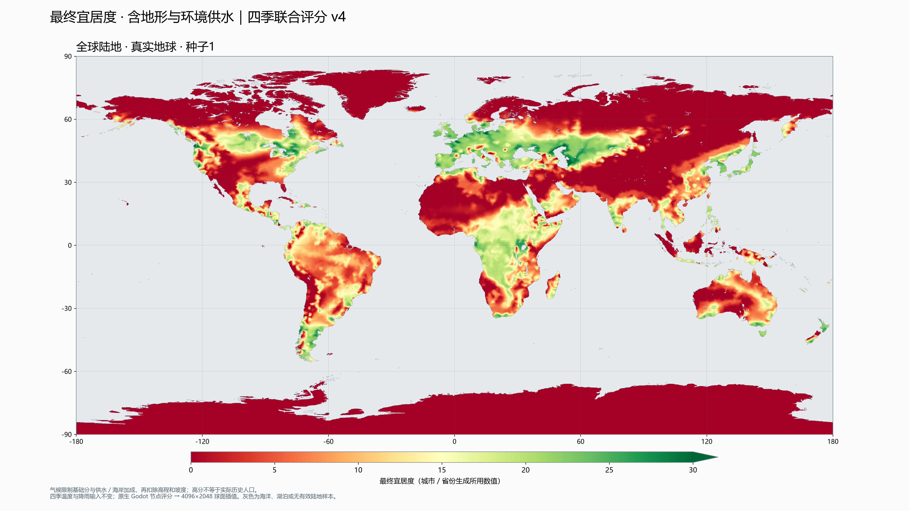
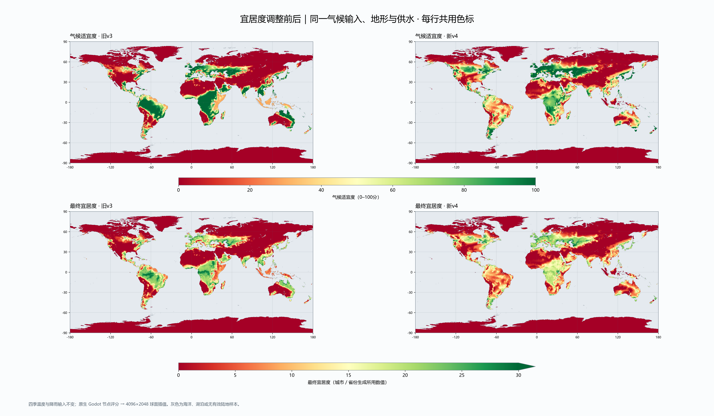
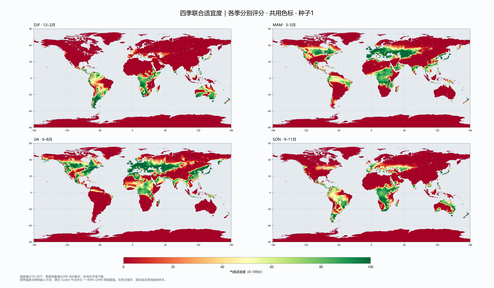

# 四季联合宜居度 v4

2026-10-09。原生 Godot 宜居度模型更新为 `climate_capacity_v4`，真实地球新生成默认采用此版本。降雨仍为 `seasonal_circulation_v3`，温度、四季降雨、地形、群落和环境供水均保持原输入；不调整省份种子间距上限。

## 热力图

单幅地图 **5120×2880**，对照／四季图 **6144×3584**。

最终宜居度是省份生成与城市筛选实际使用的值，包括气候、供水／海岸加成、高程和坡度。它不是0–100量表。

[最终宜居度 PDF](seasonal_capacity/habitat-after.pdf) · [全年气候适宜度 PNG](seasonal_capacity/climate-after.png) · [气候适宜度 PDF](seasonal_capacity/climate-after.pdf)

每季图表示温度分×同季降雨分，未加入高程和供水加成；0–100分共用色标。南半球季节相反，所以采用月份标注。

| 月份 | 5120×2880单季得分热力图 |
| --- | --- |
| 12–2月 | [高清图](seasonal_capacity/quarter-djf.png) |
| 3–5月 | [高清图](seasonal_capacity/quarter-mam.png) |
| 6–8月 | [高清图](seasonal_capacity/quarter-jja.png) |
| 9–11月 | [高清图](seasonal_capacity/quarter-son.png) |

## 实际公式

- 温度：10–20℃满分；0–10℃平滑上升；20–24℃从1轻度降至0.85；24–30℃从0.85快速降至0；0℃以下和30℃以上为0。
- 季累计雨量：200–800毫米满分；50–200毫米平滑上升；800–1400毫米快速下降；50毫米以下和1400毫米以上为0。
- 使用 `smoothstep` 连接以上区间，避免阈值两侧分数突然跳变。
- 每季联合分数＝温度分数×同季降雨分数。全年气候因子＝最高两季分数平均值的1.5次方。两季满分时为1，一季满分、其余为0时约0.354。
- 以气候因子限制基础宜居度及环境供水／海岸加成，再扣除原有高程、坡度成本。潜在蒸散保留作群落及诊断数据，不再参与v4城市气候评分。
- 点击详情中的“适宜季节折算”是四季联合分数之和×3，单位为等效月份；不表示独立计算了12个月，也不再表示v3的连续生长季长度。

## 同输入对照

以下为有效陆地展示像素按纬度面积加权的**气候适宜度均值（0–100）**，不是最终宜居度或城市数量。

| 区域近似范围 | 旧v3 | 新v4 |
| --- | ---: | ---: |
| 中原，110–116°E、32–37°N | 48.1 | 55.1 |
| 欧洲中纬度，10°W–30°E、45–55°N | 82.9 | 94.0 |
| 刚果盆地，15–30°E、5°S–5°N | 97.6 | 77.7 |
| 东南亚，95–120°E、5°S–20°N | 55.8 | 26.8 |
| 非洲东南，28–40°E、25–10°S | 69.2 | 41.9 |

中原提升有限，仍受当前降雨模型春季偏少、秋季很干，以及“取最佳两季”规则限制。刚果盆地仍偏高：当前模型气温常在23–24℃，仍处于轻度热惩罚区，且有两季雨量合适。这是按已确认参数得出的结果，没有为符合预期额外降低特定地区分数。

## 输入、精度和兼容

图来自冻结种子1的 `atlas-native-generated-earth-1.bin`，仅重新评分，**本次图没有重建城市、省份或道路**。以后在预览重新生成真实地球会使用v4公式重新生成这些数据。旧快照保留原模型和布局；v3算法另存为 `climate_settlement_v3.gd`，旧v2与原版路径继续保留。

在33940个球面节点先用Godot计算非线性评分，再采用原版球面权重插值到4096×2048展示网格；不是先插值温度和雨量再评分。底层降雨仍是1°计算网格，高清输出没有增加模拟精度；有效陆地展示覆盖约99.35%，灰色为海洋、湖泊或缺少有效陆地节点。

新旧图共用输入、投影与每行色标。最终宜居度色标0–30，超过30显示为最深绿色；完整数值保留。气候适宜度和各季分数色标0–100。

数据与版本、PID、SHA256、区域边界及数值见 [manifest.json](seasonal_capacity/manifest.json)，浮点场及掩码见 [suitability_fields.npz](seasonal_capacity/suitability_fields.npz)。

## 验证与复现

`atlas_seasonal_capacity.gd` 先在旧模型上确认9项失败，再在v4下全部通过，覆盖最佳两季、单季折扣、雨热错季、冷冬、干湿与高温截断、20℃附近连续变化及评分范围。

`atlas_climate_settlement.gd`、`atlas_climate_limits.gd`、`atlas_earth_circulation.gd`、`atlas_native_habitat.gd`、`atlas_native_regions.gd`、`atlas_native_compile.gd`、`atlas_circulation_snapshot.gd` 均通过。导出校验确认旧v3最终宜居度逐值相同，v4重复评分逐值相同，温度、降雨、高程、海陆、群落和供水输入逐字节相同。

运行 `scripts/tools/atlas_export_seasonal_capacity.gd` 后运行 `scripts/tools/atlas_plot_seasonal_capacity.py`。日志保存在本目录的 `*-log.txt`／`*-err.txt`；Python仅用于开发绘图，运行时评分在Godot内完成。

本次未接入军事／贸易，未提交、未推送。
