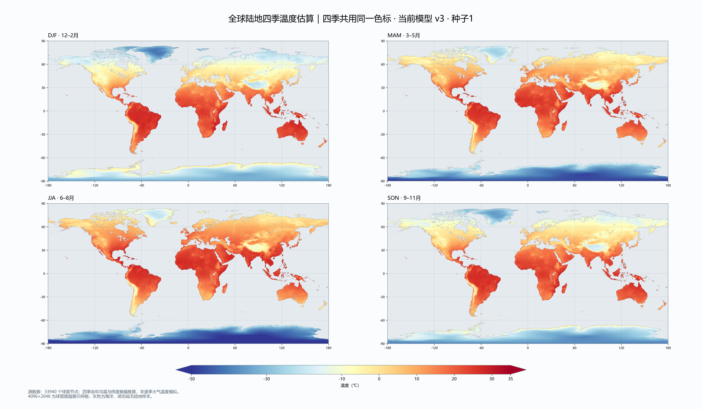
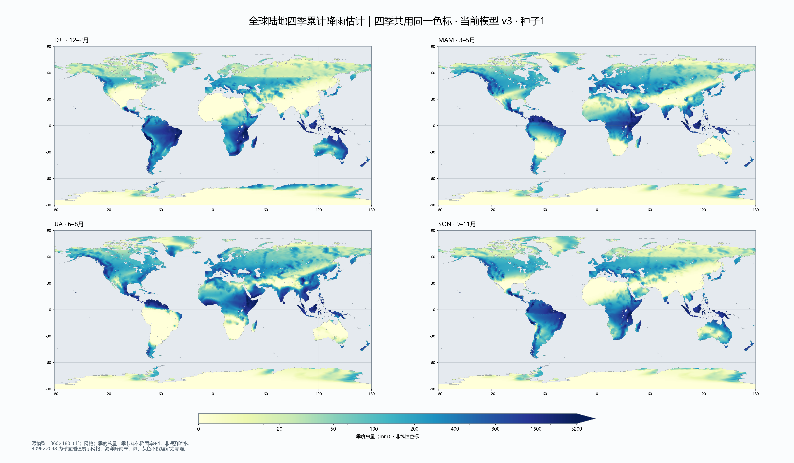

# 当前真实地球：四季温度与降雨热力图

2026-10-09，种子 **1**，使用冻结的原生地球快照 `atlas-native-generated-earth-1.bin`，降雨模型 `seasonal_circulation_v3`，聚落模型 `climate_capacity_v3`。本次仅导出和绘图，没有调整温度、降雨、城市或省份。

## 四季对照

对照图 **6144×3584**，单季图 **5120×2880**。每种指标四季共用同一个色标；季度按 DJF（12–2月）、MAM（3–5月）、JJA（6–8月）、SON（9–11月）排列，南半球季节相反。

[温度对照 PDF](seasonal_heatmaps/temperature-four-seasons.pdf) · [降雨对照 PDF](seasonal_heatmaps/rainfall-four-seasons.pdf)

## 高清单季图

| 月份 | 温度 | 累计降雨 |
| --- | --- | --- |
| 12–2月 | [温度](seasonal_heatmaps/temperature-djf.png) | [降雨](seasonal_heatmaps/rainfall-djf.png) |
| 3–5月 | [温度](seasonal_heatmaps/temperature-mam.png) | [降雨](seasonal_heatmaps/rainfall-mam.png) |
| 6–8月 | [温度](seasonal_heatmaps/temperature-jja.png) | [降雨](seasonal_heatmaps/rainfall-jja.png) |
| 9–11月 | [温度](seasonal_heatmaps/temperature-son.png) | [降雨](seasonal_heatmaps/rainfall-son.png) |

## 数据口径与实际精度

- 温度来自 **33940 个球面节点**的年均温估计，再按当前宜居度公式推算四季：`T季度 = T年均 + 12 × 季节系数 × sign(纬度) × abs(sin(纬度))`，系数依次为 `[-0.85, 0.4, 0.85, -0.4]`。不是观测气温，不是逐季独立的大气温度求解，也不是海表温度。
- 降雨求解网格为 **360×180（1°）**。图上是**每季度总雨量估计，mm/季度**，即保存的季节年化降雨率除以4；四季相加等于年降雨估计。降雨色标在20 mm以下线性、以上对数变化，标注始终是实际毫米数；高于3200 mm的值显示为最深颜色，完整数值仍保留。
- 将现有球面三角形投影到 **4096×2048** 展示网格，使用原版体积重心权重插值。只归一化陆地顶点，避免把海洋零雨量掺入海岸。海岸掩码使用原有6角分海陆数据。没有重新划网格、增加气候求解分辨率或引入高精度气候观测。
- **高清像素不等于新增模拟精度。** 灰色代表海洋、湖泊或缺少有效陆地样本；海洋降雨没有计算，不能将灰色理解为零降雨。有效样本覆盖约99.35%的陆地展示像素，剩余主要为粗球面网格未覆盖的小岛／海岸细部。

## 校验与复现

原节点校验：四季温度均值相对年均温最大误差小于0.000001℃；四季雨量之和相对年雨量最大误差约0.0013 mm；重算四季气候因子与存储值最大误差小于0.00000003。

投影后校验：温度平均误差约0.000008℃，雨量求和误差约0.004 mm；有效陆地数值全部有限，降雨非负，原版球面投影没有孔洞。以上是导出一致性检查，不表示模型与实测气候的误差。

原始浮点展示字段见 [seasonal_fields.npz](seasonal_heatmaps/seasonal_fields.npz)（约73 MB，含四季温度、季度雨量、经纬度和陆地掩码）；输入参数、版本、源快照和输出 SHA256 见 [manifest.json](seasonal_heatmaps/manifest.json)。

先运行 `scripts/tools/atlas_export_seasonal_heatmaps.gd`，再运行 `scripts/tools/atlas_plot_seasonal_heatmaps.py`。Godot只读快照并生成投影权重，Python仅负责开发绘图；游戏运行时不依赖Python。
