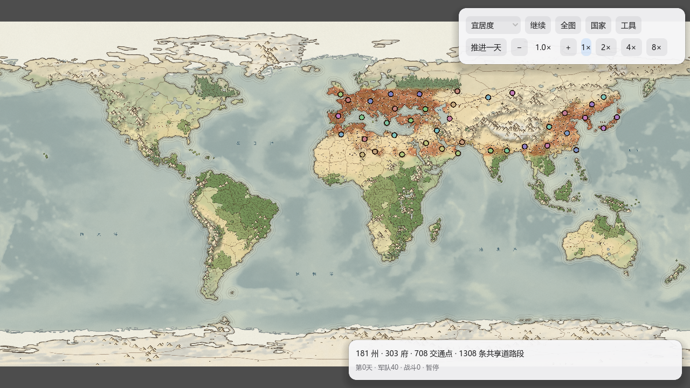
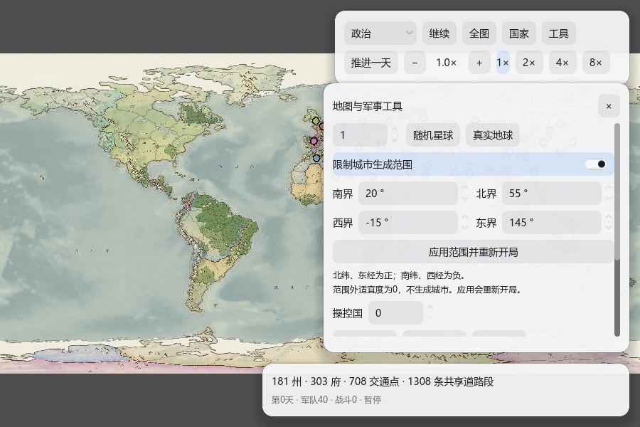

# 欧亚局部城市生成遮罩

2026-10-10。用户确认范围：北纬20°～55°、西经15°～东经145°，用于减少军事模拟规模。
主入口 `atlas_military.tscn` 默认开启；独立预览及缺少配置的旧模板保持全球模式。

## 行为与边界

`scripts/atlas/settlement_mask.gd` 用等距圆柱投影坐标判断地块经纬度，边界包含端点，支持跨180°经线。
`Habitat.build()` 先保留全球原气候与适宜度计算，再将遮罩外的最终适宜度、承载量置0；
这一结果传入省份划分、州治筛选和府选址，所以不是在生成完军队后删除对象。
省份数量与布局可能随遮罩改变。范围内气候、地形和适宜度公式未调整。

州治／府必须在范围内。托管无人领土、原有地形标记仍覆盖全球，道路按原地形规则可经过范围外，
这些道路中的交通点不作为城市或资源源。遮罩减少模拟治所及路网，未省去全球环境或栅格初始化。
不会把无法到达的独立城市强行跨海连接。

“工具”中修改只是待应用配置；应用会重新开局，先经过现有重建及日结算保护并暂停旧模拟。
生成范围内没有合格州治时明确报错并保留旧世界，不导入空军事图。
遮罩版本、开关和坐标保存到生成参数、快照、地图模板与历史布局；启动缓存纳入规范化配置，
旧全球缓存不能命中启用遮罩的新局。读取旧模板关闭遮罩，不修改其旧城市。

## 实测与验证

同为真实地球、种子1、气候v5／适宜度v6、40国、城市阈值1：

| 数据 | 原全球 | 欧亚遮罩 |
| --- | ---: | ---: |
| 州治 | 681 | 181 |
| 州治与府合计 | 1796 | 484 |
| 含交通点的模拟节点 | 4321 | 1192 |
| 新局共享道路段 | — | 1308 |

完整原生生成33940个球面地块，30350个在范围外，31032项流水线检查通过。
检查范围外两个字段均为0、所有州治与府在范围内、网格及全球气温／降雨／风场／地形与全球输入逐字节一致，
并验证新模板往返、历史配置保留、错误配置拒绝、空城市保护和旧全球模板回归。
原生生成36.2秒、军事准备1.34秒是本次并行长跑环境下的单次记录，不作稳定性能承诺。

局部地图35天军事烟测无失败，日计算平均53.08毫秒、中位13.05毫秒，第一天和战略批次有峰值。
这是headless早期开局计算数据，不代表GUI帧率，也不能外推到战争密集期或30年。
正在运行的全球30年审计保留其原始世界与已加载版本，不属于本遮罩的长期证据。

真实GPU（Godot4.7.1、RX7600、D3D12 Forward+）输出并查看全图宜居度、1280×720和900×600工具面板。
另以PID27956禁用启动缓存直接启动正式场景，实际重新生成得到同样484个治所、1192个节点，截图后正常退出。
生成、气候、启动缓存、时间控制、信息框、入口、模板、旧地图持久化及生命周期回归均通过；
代码图谱已增量更新。源码指纹和实际GPU PID见 [证据清单](evidence/settlement_mask/manifest.json)。

后续日均优化统一使用本场景；首轮战争期结果见 [DAILY_COMPUTE_V5.md](DAILY_COMPUTE_V5.md)。手动长跑脚本已改为欧亚默认输入，使用独立 `.dbg/atlas-eurasia-thirty-year/` 目录。
