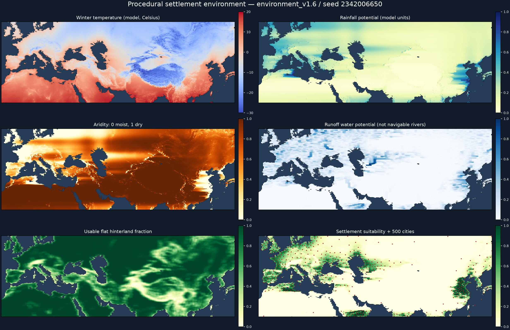
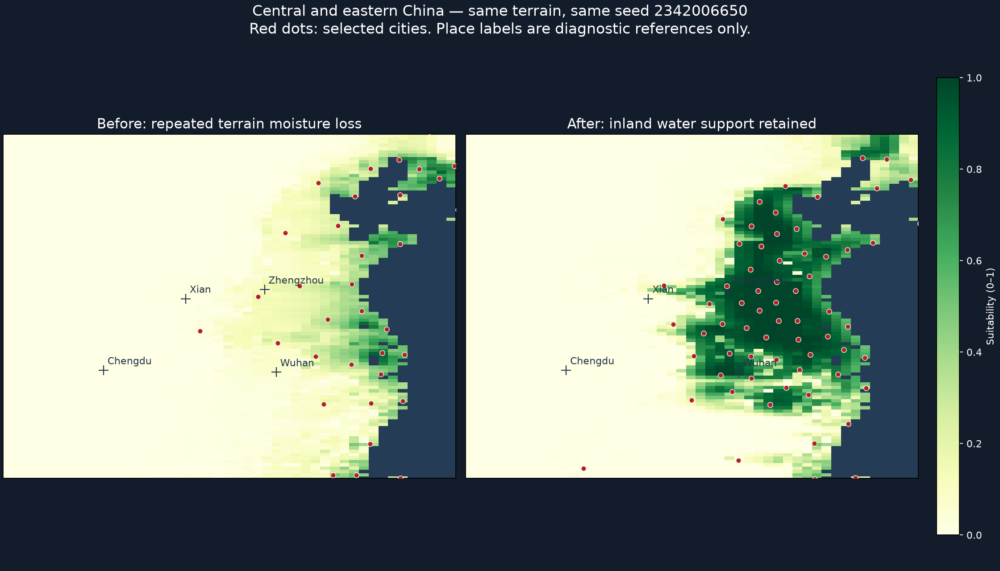
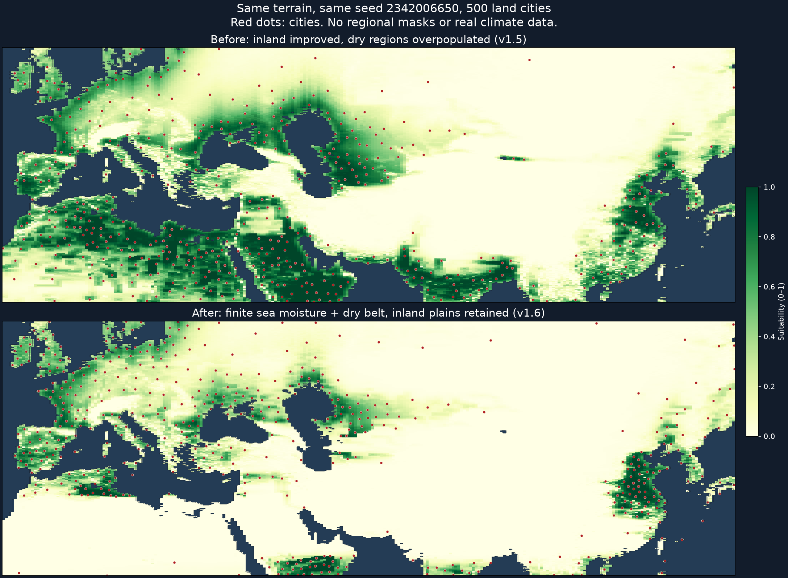

# 地形推导的城市生成

后续候选实验（统一河岸供水、连通谷地、5%～100% 选址权重）见[河岸聚落实验记录](river_settlement_experiments.md)。候选尚未切换正式场景。

本文记录环境模型阶段的实现与基线。当前欧亚场景已接入后续的[地形水文流程](terrain_hydrology.md)，默认清单为 `eurasia_hydrology_map_source.json`；模板当前写入版本7，继续读取旧版本，以下版本6说明属于环境模型阶段记录。

## 基线与启用

本次开发前，“代码推送者”已将已有欧亚地图、墨卡托与道路优化提交并推送为
`68578f5a005bc72cb4632a084d2964e51c9c4813`；当时本地 HEAD 与 origin/main 一致、工作区干净。
旧道路优化保留。原用户种子2342006650的完整世界生成冷进程约12.91秒，其中道路约1.53秒；
这些是旧版单次记录，不能直接与下面的新选址五次中位数当作同一计时范围比较。

`eurasia.tscn` 现在引用 `assets/terrain/eurasia_environment_map_source.json`，
复用原墨卡托纹理，范围仍为18°～57°N、12°W～136°E，500座陆地城市、40国，码头另计。
不更改默认启动场景，不下载高程，也不导入真实气候、水文或人口数据。

地图源版本仍为1，可选 `settlement_model` 只接受 `legacy`、`environment_v1`，缺省为前者。
中国源、原欧亚等距源、原欧亚墨卡托源保持原算法；模板版本仍为6，恢复实际地图源和既有坐标，
不自动迁移或重新撒点。当前算法标识为 `environment_v1.6` / `weighted_local_v1`。

## 数据流与规则

`SettlementEnvironment.build` 接受原始高程图、分析图、海陆数组、逐行纬度、投影宽高比和投影身份。
当前欧亚分析尺寸为256×256。纬度通过当前投影反变换获得；编辑器仍可覆盖上下纬度。
环境计算不访问模拟随机数，也不读取真实城市、人口或区域气候蒙版。

1. 高程与实际纬度决定温度；到实际海面的投影距离决定海洋影响和内陆冬季寒冷。
   高纬生长季额外衰减，寒冷与干旱分别存储，低温本身不作为沙漠标志。
2. 四次有界水汽扫描模拟主风及较弱的反向、南北季节输送。纬度风权重连续变化，
   横向混合避免海岸转角产生直线条带；实际海面补水、陆地衰减、迎风坡凝结、背风失水。
   当前水汽超过海拔对应的容量才凝结，不再对每次小幅爬升重复扣水。
   海面按经过距离与离岸宽度逐步补湿，窄水体不会立即将气团补满。副热带背景降雨受到连续衰减，
   另以有限的暖季海洋输送估计生长季供水；低纬已有主风供水不再重复获得同等季节加成。
   裁切边界采用统一背景水汽，不伪装为海岸，也不假设地图外存在海洋。
3. 降雨与蒸发需求形成干旱程度。陡降路径及等高平台的出口距离构成无环汇流图，
   有出口的平台向低处汇集，封闭盆地保留汇流。供水潜力允许干旱谷地优于周边荒地。
4. 原图局部起伏、邻域可用平缓陆地比例、水分和寒冷共同决定适居性。
   水分支持度使用 `pow(smoothstep(0.10, 0.65, moisture), 1.5)`：严重缺水强衰减，
   中等供水可支持内陆聚落，供水充足后收益饱和。这是游戏尺度约定，不是实测降雨阈值。
   不给地图中心、东侧或东南侧额外加分，不设置统一最低城市密度。

`SettlementSampler.sample` 使用独立种子生成 `-log(U)/weight` 随机优先顺序，
用空间网格检查邻域间距。投影距离为 `(u × aspect, v)`；适居性越低，要求间距越大。
每个分析格最多一城，在格内确定性扰动位置，并核对原始高程仍为陆地。
按1、0.95、0.9、0.85、0.8五档最多放宽间距；不取消适居性门槛、不回退到无间距撒点。
格子、扰动坐标及省份种子保持对应，无硬性边框禁建带。

环境结果仅用于选址。人口、产出公式、国家分配、省界河流、码头、道路高程通行性和寻路规则沿用现有实现。
新布局自然会改变省份、河流走向、交通与后续模拟结果。供水潜力不是可航行河网。

## 缓存、失败与编辑

- 环境缓存独立于城市布局，键包含原图与分析图内容、海陆数组、逐行纬度、投影身份、
  分析尺寸、宽高比和算法版本；最多保留8组。换城市种子可复用环境。
- 布局缓存沿用生成器缓存，并在新模式加入环境/采样版本和高程文件内容身份。
  原有城市/政治蒙版、城市数、国家数、纬度设置、种子及地图源仍参与键。
- `TerrainMapGenerator.build` 失败返回 `{ok:false,error,...}`；
  `GameState.generate_world` 返回布尔结果，错误保存在 `last_generation_error`。
  生成器失败、候选不足或政治蒙版无实际城市时，世界重置尚未发生，保留当前状态和模拟随机流。
  主场景只在生成成功后切换世界，编辑器显示错误并保留原地图。
- 环境模式停用峰值纬度、南端倍率、北端倍率三个旧密度控件，明确提示密度由环境计算；
  上下纬度仍可编辑，墨卡托仍限制在±85.0511287798°。
- 日志保留实际世界种子、独立 `world_index` 与城市布局种子，新增模型版本、环境哈希、
  候选数、间距档位、环境/采样耗时及缓存命中标记。`layout_cache_hit=true` 时耗时是缓存创建时的记录，
  不代表本次读取又运行了算法。模板恢复的世界不伪造环境计时，继续记录模板来源与实际地图源。

## 诊断与验收记录（2026-10-07）

诊断图展示模拟冬季温度、降雨、干旱、汇流供水、平缓腹地、适居性与城市落点。
这是一套自洽的游戏近似环境，不承诺复原真实欧亚气候或历史人口分布。
黑海、里海等现有海陆图中的水体均按可供水面处理；没有另外识别完整湖泊系统。



五次独立进程、同机 Godot 4.7.1 Debug/headless、500城测量；测量区间从环境构建开始，
到城市采样结束，包括环境内容哈希，排除纹理读入、下游省份/道路/国家和画面初始化。

| 进程 | 首次环境+采样（ms） | 缓存环境+新种子采样（ms） |
| --- | ---: | ---: |
| 1 | 1412.771 | 916.903 |
| 2 | 1366.327 | 790.063 |
| 3 | 1391.859 | 794.319 |
| 4 | 1370.356 | 792.367 |
| 5 | 1361.543 | 789.264 |
| 中位数 | **1370.356** | **792.367** |

满足3000ms / 1000ms目标。性能数字不是完整场景启动时间。

- 合成环境20种子：严重干旱缺水区0城/6960陆地格，温暖湿润平原556城/729陆地格，
  单位陆地面积密度比 **0%**，低于10%。等面积35°/75°纬度夹具的极寒区密度比为0，低于5%。
  欧亚本图北界仍为57°N，未据此宣称覆盖整个西伯利亚。
- 海岸、山脉、盆地夹具验证海洋调温、迎风降雨、雨影、下游汇流、封闭盆地；
  29.9°/30.1°风权重连续性、确定性和裁切边界非海岸性检查通过。
- 采样20种子逐对检查投影间距、格内落点、唯一种子格、确定性及不足提示；
  用户种子2342006650诊断图500个城市纵坐标均不同，没有恢复贴边同排布局。
- 五种子2342006650、12345、23456、34567、45678均500城/40国，码头分别51、49、50、50、53。
  城市陆地落点、国家拥有合法初始城市、省份完整覆盖、河流、双岸码头及西欧—中亚—中国非海运交通契约通过。
  道路继续满足既有高程/海陆和省份接口约束。
- 同进程中国→旧欧亚→墨卡托欧亚→环境欧亚→中国隔离、旧模板坐标恢复、历史地图源检查通过。
  环境缓存对高程、纬度和投影变化失效，换城市种子命中环境并产生不同布局。
- 实际 D3D12 场景的城市移动、交通重建、再生成、模板读入、历史回看、镜头和射线拾取通过；
  已查看全图、地中海、中国预览。75°～85°生成失败时保留旧世界。
  本地证据为 `.dbg/final-inland-visuals/`、`.dbg/final_inland_scene_smoke.log`，日志 world_index 为1..4。
  该场景烟测固定世界seed=12345，按既有固定场景规则使用布局seed=0；五种子世界测试分别显式使用对应布局种子。
- 365天、seed=12345、初始500城/40国：17次宣战、108次归属变更、89座净攻占；
  领土结构、财政合法性、命令提交、战斗绑定、继承、重复绑定和冷却违规错误均为0。
  粮食短缺2615军队日、国家欠饷0月；缺粮是模拟事件，不宣称资源永不短缺。
  本地证据为 `.dbg/final_inland_ai_longrun.log`。
- 地图投影、纬度密度、纬度产出、区域策略、地图要素/模板、省份连通、编辑、道路运行与道路优化对照回归通过。
  中国原500城/80国场景的实际3D烟测、地形烟测、复现日志14项检查也通过。
  中国原500城外交对象数量断言的既有失败继续保留，未纳入本轮修复；基线复现说明见 `eurasia_scenario.md`。

## 内陆漏判修正

初版v1.3虽然通过了稀疏性测试，却没有充分检验中等供水的内陆平原。
用户指出中原大片适居陆地被忽略后，补充检查发现：连续小丘会逐次扣减同一气团的水汽，
水分平方又把中等供水地区的选址权重压得过低，该权重还会增大采样间距。
排序和间距共同限制内陆选点，但不能据此把最终城市密度简单推算为权重的平方。

v1.5改为按当前水汽与海拔容量凝结，把输送衰减长度由地图高度的0.65调整为1.0，
同时使用充足后饱和的供水支持度。其物理启发是上升空气冷却达到饱和后产生地形降水，
见 [美国国家气象局的地形抬升说明](https://forecast.weather.gov/glossary.php?word=orographic)；
数值容量、距离尺度及支持度曲线均为游戏近似，不是现实气候拟合。
用户明确选择优先保证内陆平原、河谷聚落带，接受真实气候偏差；未加入地区特例或人口数据。

新增 `settlement_inland.gd`，用同一35°低地分别比较无屏障、5个155米低丘和4公里高山：

- 初版无屏障内陆适居性仅近岸的13.93%；当前v1.6为69.26%。
- 初版低丘使内陆适居性再降至46.71%；修复后不会反复扣除已凝结的水汽，该夹具为100%。
- 真正高山的背风降雨仍只有无山的18.52%，保留显著雨影。
- 全部诊断字段有限，适居性位于0～1。真实模型和采样器的干旱/极寒20种子检查继续通过。

欧亚原图相同落点周围5×5陆地格的适居性均值：

| 诊断落点 | v1.3 | v1.6 |
| --- | ---: | ---: |
| 郑州附近（113.6°E，34.75°N） | 0.128 | 0.929 |
| 华北平原（116°E，36°N） | 0.091 | 0.902 |
| 武汉附近（114.3°E，30.6°N） | 0.057 | 0.832 |
| 长江下游（119°E，32°N） | 0.463 | 0.966 |
| 塔里木盆地（83°E，40°N） | 约0 | 0 |

seed=2342006650下，108°～118°E、29°～37°N诊断窗口的城市由6座变为31座。
该窗口只用于输出比较，不参与算法，也没有按窗口指定城市数量。



这次修复没有重写汇流或可航行河道。四川盆地、狭窄谷地等仍受粗网格与简化水汽路径影响，
不能由中原改善推断所有真实宜居区都已还原；也不声称实际沙漠边界与现实一致。
距离仍以投影地图高度归一化，裁切地理范围可能改变环境结果，不承诺不同裁切图的气候相同。

## 北非与阿拉伯过密修正

v1.5解决了内陆失水，但把每个海面格当作无限水汽源，并缺少副热带干燥约束，
导致红海等狭窄水面附近及北非、阿拉伯内陆被高估。v1.6改为有限海面补湿、
连续副热带降雨衰减，并限制重复的低纬暖季加成。暖季项要求有足够的输送水汽，
统一裁切背景湿度本身不能激活它；宽海洋输入仍能支持同纬度的湿润内陆。
机制参考 [NOAA副热带下沉气流说明](https://oceanservice.noaa.gov/facts/horse-latitudes.html)
和 [NOAA季风说明](https://www.nesdis.noaa.gov/about/k-12-education/severe-weather/what-monsoon)。
东来与向极输送、纬度曲线和归一化距离阈值均为游戏模型约定，未导入实测数据，
输出降雨字段表示包括生长季供水的潜力，不是可直接解释为毫米的年降雨量。

`settlement_dry_belt.gd`验证同一低地的窄水体降雨潜力仅为宽海洋的3.53%，
副热带缺水内陆受到抑制，而有宽海洋供水的同纬度低地仍适居。
内陆夹具将上风海面从8格扩至48格，保持陆地、海岸和每格物理尺度不变；
极寒夹具的两条等面积纬度带均采用相同的宽海洋，保留20种子和5%密度门槛。
这些修订避免把狭窄水渠继续当作无限海洋。

真实欧亚图跨20种子、每次500城的投影陆地面积归一化统计：

| 诊断窗口 | 陆地格数 | v1.5累计城市 | v1.6累计城市 | v1.6密度/中国内陆 |
| --- | ---: | ---: | ---: | ---: |
| 中国内陆108°～118°E、29°～37°N | 799 | 257 | 582 | 100% |
| 撒哈拉内陆0°～30°E、20°～29°N | 2546 | 1002 | 15 | 0.81% |
| 阿拉伯内陆40°～50°E、20°～29°N | 811 | 504 | 114 | 19.30% |

中国内陆平均适居性由0.5221保持为0.5228。城市增加也包含固定500城预算从干旱区重新分配的效果。
地理窗口仅用于回归诊断，生产算法没有区域例外；这些密度使用游戏投影面积，不是真实地表平方公里。
25%区域回归门槛在v1.5两个干旱窗口均失败，在v1.6均通过。



## 复现命令

在项目根目录运行（`godot` 替换成本机可执行文件）：

```powershell
godot --headless --path . --script res://tests/settlement_environment.gd
godot --headless --path . --script res://tests/settlement_inland.gd
godot --headless --path . --script res://tests/settlement_dry_belt.gd
godot --headless --path . --script res://tests/settlement_regional_balance.gd
godot --headless --path . --script res://tests/settlement_sampler.gd
godot --headless --path . --script res://tests/settlement_distribution.gd
godot --headless --path . --script res://tests/environment_world.gd
godot --headless --path . --script res://tests/map_source_isolation.gd

# 每次启动新进程；性能验收时不要同时运行其他重负载测试。
1..5 | ForEach-Object { godot --headless --path . --script res://tests/settlement_environment_benchmark.gd }

# 诊断数据与图；Python 仅用于离线画图，游戏不依赖它。
New-Item -ItemType Directory -Force .dbg | Out-Null
$env:ENV_DIAGNOSTICS_FILE = 'res://.dbg/environment-fields.json'
godot --headless --path . --script res://tests/settlement_environment_benchmark.gd
Remove-Item Env:ENV_DIAGNOSTICS_FILE
python -m pip install numpy matplotlib
python scripts/tools/render_settlement_diagnostics.py .dbg/environment-fields.json .dbg/environment-diagnostics.png

$env:EURASIA_VISUAL_DIR = Join-Path (Get-Location) '.dbg/environment-visuals'
godot --path . --script res://tests/eurasia_scene_smoke.gd
Remove-Item Env:EURASIA_VISUAL_DIR

$env:AI_LONGRUN_MAP_SOURCE = 'res://assets/terrain/eurasia_environment_map_source.json'
$env:AI_LONGRUN_DAYS = '365'
$env:AI_LONGRUN_SEED = '12345'
godot --headless --path . --script res://tests/ai_longrun.gd
Remove-Item Env:AI_LONGRUN_MAP_SOURCE, Env:AI_LONGRUN_DAYS, Env:AI_LONGRUN_SEED
```

本轮未引入真实河网、完整湖泊、动态天气、海流、土壤、历史数据库、城市人口等级或新的经济配额。
未来程序化高程可以调用同一环境接口，但其数值高程与海陆编码须遵守当前地图源契约。
