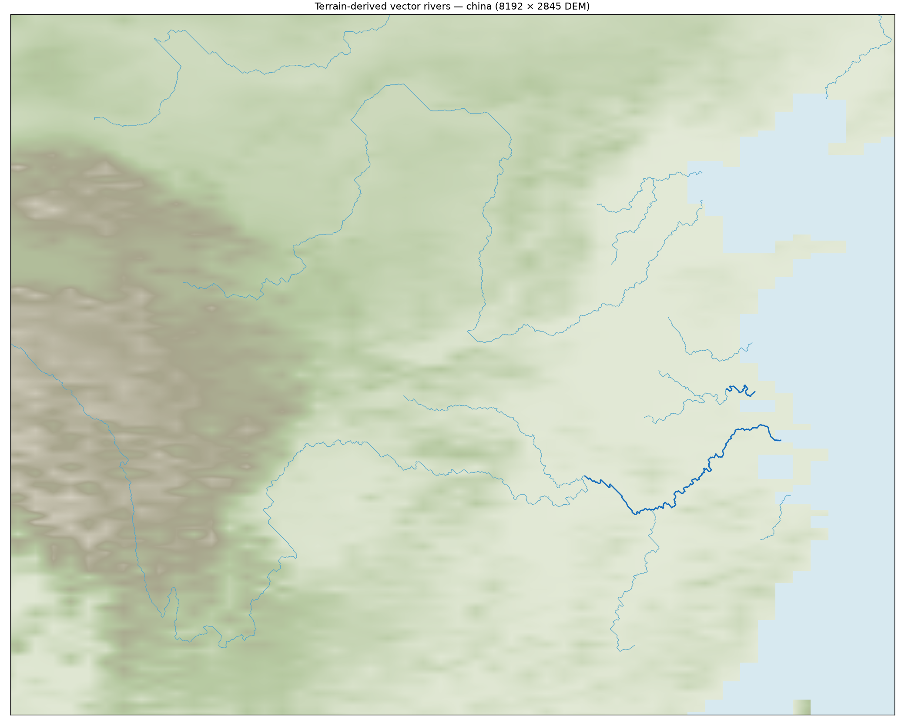

# 高精度地形水文与上游延伸

在本河网之上进行的供水与密度调整见[河岸聚落实验记录](river_settlement_experiments.md)。该候选未改变河网，且尚未替换本页的正式场景配置。

## 数据与生成顺序

独立清单 `assets/terrain/eurasia_hydrology_map_source.json` 复用欧亚墨卡托纹理。高精度河网由已缓存的 AWS Terrarium zoom=7 瓦片离线推导，使用瓦片原始高程值，不从游戏纹理的低精度 Alpha 反推排水。此次分析大小为8192×2845；输出大小不代表原始数据具备更高空间精度。没有导入真实河流、气候或历史城市数据。

流程为高程排水预处理 → 运行时简化气候及汇流 → 环境选城 → 主河约束省份 → 地形道路与码头 → 主河网络航运 → 国家。预处理与城市种子独立，游戏读取矢量 JSON，无 Python 运行时依赖；新的程序化地图可提供浮点米制 `.npy` DEM 走同一工具。

离线排水使用 Priority-Flood 辅助洼地分类、D8单下游、面积累积、汇合点切段及有界折线简化（0.7源像素）。逻辑与显示共用同一条矢量折线，省份屏障通过折线与相邻省份格中心连线的交点栅格化，河流不再吸附256×256省份格边。

高分辨率模型取代初版四邻接小洼地方案。当前保留平均填深超过30米、面积至少4个分析格、平均内部半径至少0.004地图高度的盆地；其余洼地用于分析填平，不修改显示地形。**30米是平均填深分类阈值，不是单像素最大填高上限**。此规则是游戏近似，可能疏通实际封闭的狭长洼地，也不承诺复原真实流域。当前欧亚保留8个盆地。

水面识别同时考虑高程和连通面积：与裁切边界相连的非正高程区域，以及面积至少4个分析格（小型测试图至少16个源像素）的独立水体，作为排水终点。因此缺少可分辨海峡的黑海、里海不生成水下河段。孤立的负高程小斑点仍走洼地条件化；中国河谷中实测的单像素−359米、−78米异常不会被误判成海，截断整条河。

边界来水仅在清单 `boundary_inflow: "estimated"` 时启用。入口需为裁切边界的局部谷地，实际排水路径向地图内部延伸且足够长；同一出口流域只选一处入口。当前4处，每处估算256单位。它支持从南界进入的尼罗河状长河，但不是对地图外流域面积或真实流量的恢复。

## 河流过短的修正

旧可见性规则将流量不足32单位的所有河段删除，使已建立的下游河道在上游突然消失。`vector_water_v2` 从可见河段沿**集水面积最大的上游分支**回溯，直到汇流量低于0.5或集水面积小于64单位。保留原来的水量与主次等级，不通过补水或全面降低主河门槛延长河流。

同时修复预处理的集水面积记录：上游分支记录自己汇合前的面积，不能读取共享汇合像素的合计面积，否则会选择错误的上游分支。

可见支流阈值32、主河阈值128（初版512在此供水尺度下过于稀少）；主河下游累计水量不下降。新延伸的低流量支流参与供水与显示，不参与省份屏障、码头或航运。沿河供水仍受距离、相对高差、寒冷和可耕腹地约束。

与修改前的高精度矢量样例相比，同一地图及气候下：全图可见折线总长从14.32546增至24.06960地图高度单位（+68.0%）；中国预览窗口95°～124°E、24°～43°N内裁切长度从1.16591增至3.25357（+179.1%）。全图比较同时包含删除旧水下错误河段的影响。这是**河网总长**，不是每条河都等比例变长。当前1321个可见河段，其中228个主河段；河段在汇合点切分，不等于1321条独立河流。



[中国区域SVG](images/hydrology/rivers-china.svg) · [全图](images/hydrology/rivers-full.png) · [尼罗河区域](images/hydrology/rivers-nile.png)

## 交通与兼容

主河阻断省份传播与普通陆路，支流不阻断。允许绕河源，允许无种子的隔离区域无归属。无法同时容纳城市与合规码头间距的极小隔离区域不放置城市。

道路在选择生成树前计算合法省份路径，并按实际折线路径评估高程和海陆。城市扰动不得跨到省份种子中心的另一河岸。码头接岸路也必须绕过其他主河；若同一省份格边被多个河弯重复穿过，只有两岸中心都能直接抵达目标河段的落点才可成为码头。

只有主河建立航运网络，汇合口为内部路径节点，沿途遇码头分段。航线保存明确河段及进度引用。模板版本7保存完整河网，仍读取版本3～6；旧地图清单与既有坐标不迁移。移动城市在临时结果中重建，验证成功才替换，河网保持不变；有不安全军队绑定时拒绝移动。

## 重建及验证命令

项目根目录，Python只用于离线预处理和诊断：

```powershell
python -m pip install numpy scipy numba Pillow matplotlib
python scripts/tools/preprocess_hydrology.py --tile-cache .dbg/elevation_tiles --bbox -12 18 136 57 --width 8192 --output assets/terrain/eurasia_vector_drainage.json
# 程序化地图改用 --dem path/to/metres.npy；行0为北侧，范围由bbox给定。
python -m unittest discover -s tests -p test_preprocess_hydrology.py
godot --headless --path . --script res://tests/hydrology_headwaters.gd
godot --headless --path . --script res://tests/hydrology_landing_barriers.gd
godot --headless --path . --script res://tests/hydrology_world.gd
godot --headless --path . --script res://tests/hydrology_regional_balance.gd
$env:ENV_DIAGNOSTICS_FILE = 'res://.dbg/hydrology-fields.json'
godot --headless --path . --script res://tests/hydrology_benchmark.gd
Remove-Item Env:ENV_DIAGNOSTICS_FILE
python scripts/tools/render_hydrology_diagnostics.py .dbg/hydrology-fields.json .dbg/river-previews
```

五个开局种子2342006650、12345、23456、34567、45678均通过500陆地城市、40国、合法省份、双岸码头、模板往返与西欧—中亚—中国无海运通路检查；码头分别104、101、94、99、95座。同一进程的中国→旧环境欧亚→新水文欧亚→中国/旧环境欧亚缓存隔离通过。

20种子区域诊断：中国内陆530城、撒哈拉内陆17城、阿拉伯内陆104城；按各窗口陆地面积归一后的干旱区密度分别为中国内陆的1.01%、19.33%。合成严重干旱及极寒区检查分别为湿润平原密度的0%、0%；现实窗口不与合成严重干旱阈值混用。

最终海陆修正后的五次独立进程测量：气候、水文与500城采样冷运行中位数1603.599ms，复用环境后的换种子采样中位数678.914ms（单次范围冷1587.909～1664.802ms、热649.037～798.980ms）。这些数字不含后续省份、交通、国家模拟初始化及3D显示准备。预处理的最后一次完整重建耗时28.28秒，依赖和Numba编译缓存已就绪。

实际D3D12场景验证通过城市移动（保持同一河网）、编辑重新生成、模板保存读入、历史回看、点击拾取及大陆交通检查。既有渡河战争正向测试与反攻测试63项检查通过。

最终365天水文局seed12345通过，完成11次战争、119次领土易手；领土、军队/战争绑定、财政有效性和逐日继承审计均无错误。正常的粮食短缺仍会发生（3351个军队短缺日），本次未修改经济公式。

长跑曾暴露既有的区域叛军初始化遗漏：无常规军队动员时，新君主只建立谱系，未初始化子代。已在成功叛乱创建入口显式初始化世代，独立最小复现由失败转为通过，并通过反攻继承、分封继位37项及宗室绝嗣252项回归；最终长跑未再触发该错误。

`eurasia.tscn` 已切换新水文清单，默认启动场景仍为 `main.tscn`。旧清单和模板保留原有河网，不重新迁移坐标。新河网在重新启动欧亚场景并创建地图时生效。原环境版基线仍保留，本轮未提交或推送。
